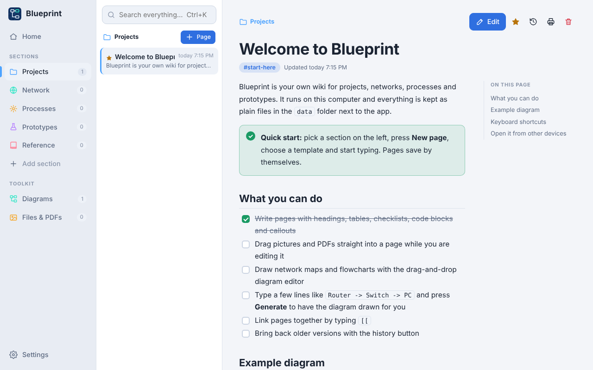
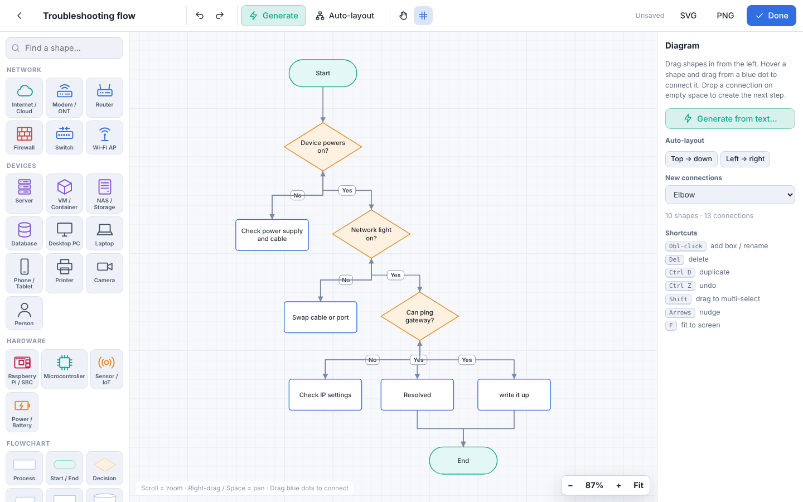
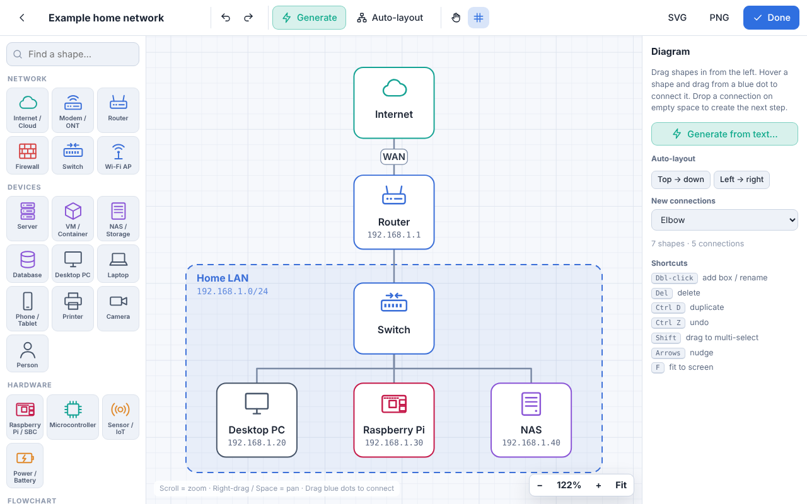

# Blueprint Wiki


A locally hosted wiki for prototyping, technical documentation and projects.
Runs on a Raspberry Pi, Linux, Mac or Windows. Needs only Python 3 — nothing to install, no internet required.




## Start it

**Raspberry Pi / Linux (easiest):**
```
git clone https://github.com/hardwaremack-prog/blueprint-wiki.git
cd blueprint-wiki
bash install-pi.sh
```
This adds a **Blueprint Wiki** icon to your Desktop and app menu, starts the wiki every time you log in, and opens it.

**Or just run it:**
```
python3 server.py --open
```
Then go to **http://localhost:8080**. If 8080 is already taken it uses 8081–8083 instead. Use `--port 9000` to pick your own.

**Windows:** double-click `start-windows.bat` (needs Python from python.org).

**From other devices:** any phone, tablet or PC on the same network can open it at `http://<pi-address>:8080`.
The exact address is printed when the server starts and is also shown in **Settings → Network access**.
(To keep it private to one computer, run `python3 server.py --host 127.0.0.1`.)

## What's in it

- **Tabs down the left side** — your own sections (rename, recolour, reorder in Settings), plus Diagrams and Files.
- **Rich pages** — headings, bold/italic, lists, checklists you can tick, tables (add/remove rows and columns), code blocks, callout boxes, quotes, dividers, web links and `[[` page links.
- **Pictures** — drag, paste or insert; click one while editing to size it (25–100%) or align it; click while reading to enlarge.
- **PDFs** — drop a PDF into a page and it shows inline with Open / Download buttons. Other files appear as download cards.
- **Diagram toolkit** — full-screen drag-and-drop editor:
  - 35 shapes: routers, switches, firewalls, Wi-Fi APs, servers, NAS, PCs, phones, cameras, Raspberry Pi, microcontrollers, sensors, power, plus flowchart shapes, sticky notes, text and group zones
  - hover a shape and drag a blue dot to connect; drop on empty space to create the next step
  - elbow / straight / curved connections, labels, arrows, dashed lines, colours
  - multi-select, align, distribute, group into zones, copy/paste, undo/redo, zoom and pan, snap to grid
  - **Generate from text** — type `Router -> Switch -> PC, Printer` or just list the steps of a process and it draws and lays it out for you (six starter templates included)
  - **Auto-layout** top-down or left-to-right
  - export PNG or SVG; embed any diagram in any page
- **Templates** — Project, Device record, Network overview, Procedure, Prototype log, Troubleshooting, Notes.
- **Search** everything (pages, tags, diagram labels, file names) with Ctrl+K.
- **Version history** with one-click restore.
- **Auto-save**, pinning, tags, table of contents, light/dark theme, print / save page as PDF.
- **Backup & move** — Settings → Download backup gives one zip; Import it on another Pi to copy everything across.

## Your data

Everything lives in the `data` folder as plain files:

| Folder | Holds |
|---|---|
| `data/pages` | one JSON file per page |
| `data/diagrams` | one JSON file per diagram |
| `data/files` | your pictures, PDFs and attachments, untouched |
| `data/history` | older versions of pages |
| `data/trash` | anything you delete (nothing is ever destroyed) |

## Updating the app

Run `git pull` (or replace `server.py` and the `static` folder with the new version) and restart. Your `data` folder is never touched by updates.

## Keyboard shortcuts

| Keys | Does |
|---|---|
| Ctrl+K | Search |
| Ctrl+E | Edit page / finish editing |
| Ctrl+S | Save now |
| `[[` | Link to another page |
| Tab / Shift+Tab | Indent / outdent list items |
| Diagram: Del, Ctrl+D, Ctrl+Z, arrows, F | Delete, duplicate, undo, nudge, fit |

## More screenshots

| Generated flowchart | Home |
|---|---|
|  |  |
